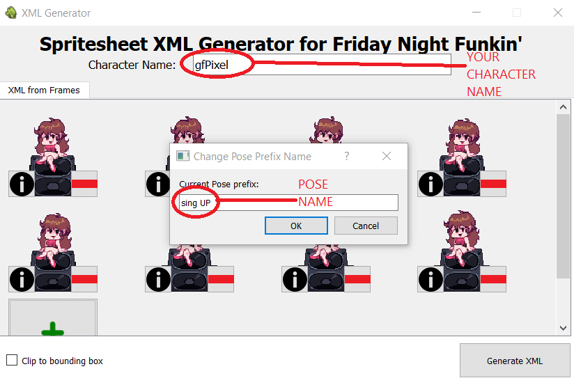

# FnF-Spritesheet-and-XML-Maker
A Friday Night Funkin' mod making helper tool that allows you to generate XML files and spritesheets from induvidual pngs. This is a free and open-source mini-replacement tool to the "Generate Spritesheet" functionality in Adobe Animate/Flash

##### Disclaimer: The execuatable on gamebanana only works on windows. Other operating system users should run this from source. Instructions at the bottom of this page.

## How to use this tool:

The name of your character goes into the textbox at the top. This is necessary as the final xml and png files will be named accordingly.
Eg: If you name you character <b>Pixel-GF</b> the files generated will be named <b>Pixel-GF.png</b> and <b>Pixel-GF.xml</b>
Leaving this box blank will cause an error to show up.

### Adding sprite frames
Click the button named "Add Frame Image" to add each pose as frame in the spritesheet, as shown below:


Each "frame" of your spritesheet has 2 buttons on either side:
<br/>
Use the "Pose Names" button to name each pose (Eg: 'gfPixel sing down' or 'gfPixel idle') and to delete any individual frame click the "Delete Frame" button. Pose names can repeat if needed (Eg: You can name 2 frames 'gfPixel sing up' and it'll be taken care of in the xml)

### Clip to bounding box
If your induvidual frames have extra whitespace in them and you want them all cropped to just their bounding box, click this checkbox before generating the files.<br/>
<br />
On left is how the image will be considered if this checkbox is left unchecked. On the right is how it'll be considered if it is checked. <small>(Side note: Most of the time you won't really have to use this feature, but it is provided just in case)</small>

### Generating the final XML and PNG files
When you're done adding all the frames and giving them pose names, it's time to generate the final PNG and XML files!
To do so, just click the "Generate XML" button. Select the location you want the files saved and the xml and png files will be generated.<br />


<br/><br/>
<small>Note: Although the main functionality of this application is complete, there are still minor crashing issues and bugs that may need fixing. Updates will be on the way soon. Stay tuned!</small>

### How to use these files in the source code
Now that you have the .xml and the .png files you can follow the instructions as per <a href="https://gamebanana.com/tuts/13798">this guide by Tuxsuper on gamebanana</a> to add your character into the game. This particular application, as of now, is to help with section 1.3 of the guide in particular (without the use of adobe animate), excluding the parts that have to do with the icon grid. Basically, inside of Character.hx, inside the switch statement shown below:<br />
<br /><br />
Add another case like so:<br />

<br/>
Keep in mind:

<br />

## Running from source:
In order to run this from source, you will need <a href="https://www.python.org/downloads/release/python-390/">python v3.9</a> (minimum) and pip installed on your device (pip should come pre-installed with python). Install the dependencies first by opening the command line, navigating to this directory and typing ``` pip install -r requirements.txt ```. Once that is done type ``` python xmlpngUI.py ``` to run the application (Sometimes you need to type ``` python3 ``` instead of just ``` python ```). This is a required step for non-windows users!