# FnF-Spritesheet-and-XML-Maker
A Friday Night Funkin' mod making helper tool that allows you to generate XML files and spritesheets from individual pngs. This is a free and open-source mini-replacement tool to the "Generate Spritesheet" functionality in Adobe Animate/Flash
<br />
To download the application for windows instead of running it from source click on <a href="https://gamebanana.com/tools/7136">this link</a>.

## Big Update: There is a web version of this tool available [here](https://uncertainprod.github.io/FNF-Spritesheet-XML-generator-Web). If the desktop app does not work for you, then you can try this out instead. [Instructions and source code of the web version](https://github.com/UncertainProd/FNF-Spritesheet-XML-generator-Web)

##### Disclaimer: The execuatable on gamebanana only works on windows. Other operating system users should run this from source (or try out the experimental build from the releases here). Instructions to run from source at the bottom of this page.

## How to generate spritesheet and XML files for your character:
### Update: The instructions below may be a bit outdated, so consider using this video tutorial instead:
<a href="https://www.youtube.com/watch?v=lcxpa7Gc3i0">Youtube Video tutorial</a>

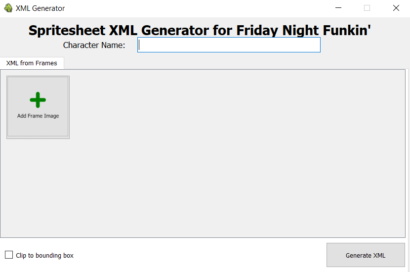
The name of your character goes into the textbox at the top. This is necessary as the final xml and png files will be named accordingly.
Eg: If you name you character <b>Pixel-GF</b> the files generated will be named <b>Pixel-GF.png</b> and <b>Pixel-GF.xml</b>
Leaving this box blank will cause an error to show up.

### Adding sprite frames
Click the button named "Add Frame Image" to add each pose as frame in the spritesheet, as shown below:
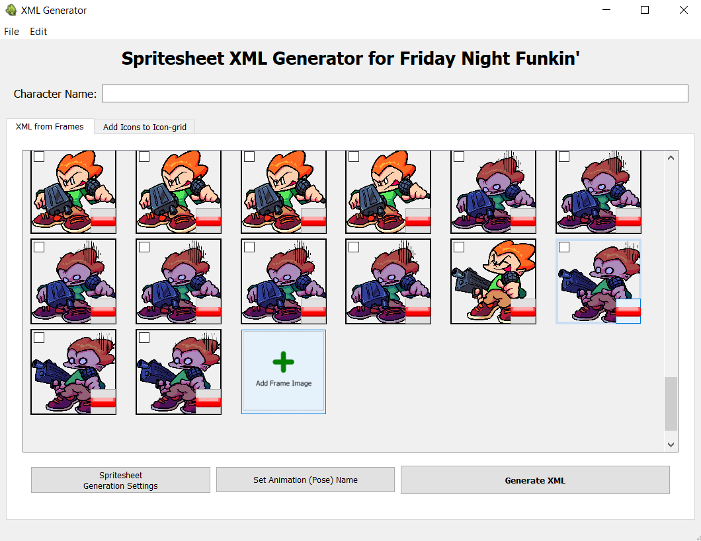
Alternatively, go to File > Import Images... to do the same. You can also import frames from existing spritesheets using File > Import Existing Spritesheet and XML

Each "frame" of your spritesheet has a button (to delete that frame) and a checkbox (to change it's animation name):<br />
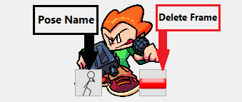<br/>
Use the "Set Animation (Pose) Name" button to name each pose that has been selected (has its checkbox checked). Animation names refer to names like: 'sing down' or 'idle'. To delete any individual frame click the "Delete Frame" button. Pose names can repeat if needed (Eg: You can name 2 or more frames 'sing left' and it'll be taken care of in the xml). 

#### To find out current animation (pose) name of any frame, simply hover the mouse over it and it'll display information about that particular frame. <br />
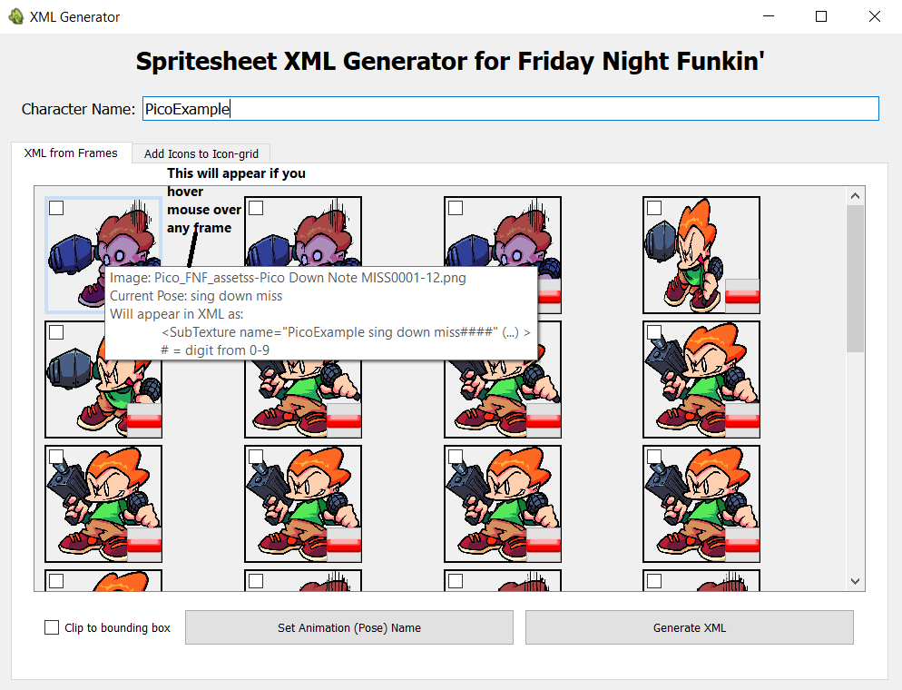 <br />

### Clip to bounding box
If your individual frames have extra whitespace in them and you want them all cropped to just their bounding box, click this checkbox before generating the files. This checkbox will show up on clicking the "Spritesheet Generation Settings" button<br/>
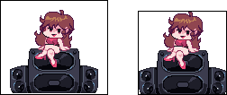<br />
On left is how the image will be considered if this checkbox is left unchecked. On the right is how it'll be considered if it is checked. <small>(Side note: Most of the time you won't really have to use this feature, but it is provided just in case)</small>

### Generating the final XML and PNG files
When you're done adding all the frames and giving them animation names, it's time to generate the final PNG and XML files!
To do so, just click the "Generate XML" button. Select the location you want the files saved and the xml and png files will be generated.<br />
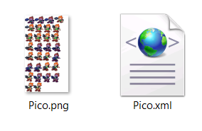

<br/><br/>
<small>Note: Although the main functionality of this application is complete, there are still minor crashing issues and bugs that may need fixing. Updates will be on the way soon. Stay tuned!</small>

## UPDATE: The instructions you see in this section below are only to be followed if you are modding the base game, not if you are using kade engine/psych engine.
#### However, the Spritesheets and XMLs generated by this tool should work for those engines too as they all follow a similar format. If you are using Kade Engine or Psych Engine, follow the specific instructions for that engine.
### How to use these files in the source code
Now that you have the .xml and the .png files you can follow the instructions as per <a href="https://gamebanana.com/tuts/13798">this guide by Tuxsuper on gamebanana</a> to add your character into the game. This particular application, as of now, is to help with section 1.3 of the guide in particular (without the use of adobe animate), excluding the parts that have to do with the icon grid. Basically, inside of Character.hx, inside the switch statement shown below:<br />
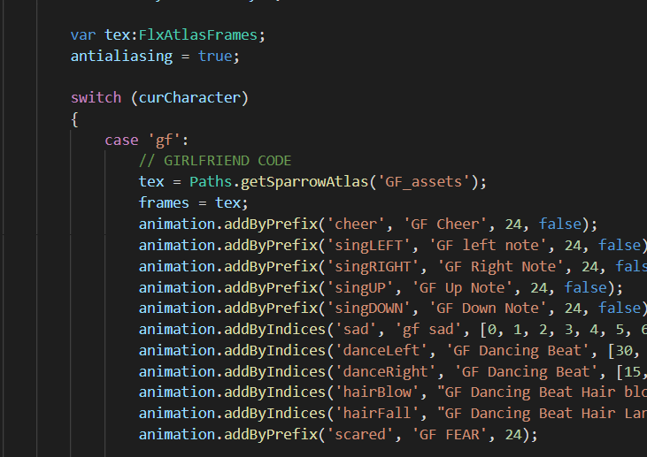<br /><br />
Add another case like so:<br />
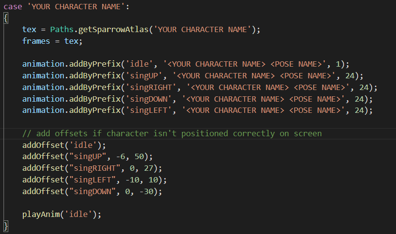
<br/>

#### Keep in mind:
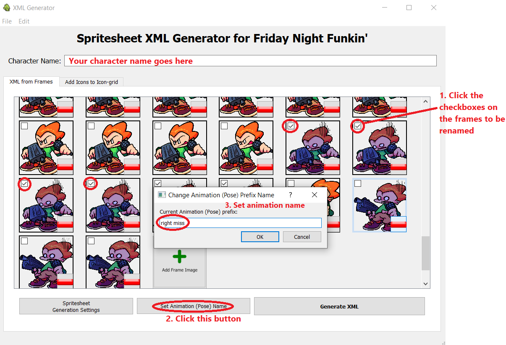
<br />

## How to add your character's icon into the icon-grid PNG using this tool:
The latest version of this tool now comes with icon-grid support, so now you can add your character's icon(s) into the icon grid provided in the game files of FNF. Here's how to add your icons into the icon-grid ( Funkin\assets\preload\images\iconGrid.png )

### Click on the tab named "Add Icons to Icon-grid"
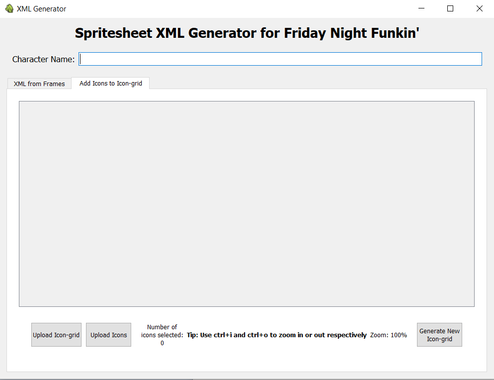

### Upload your iconGrid.png file into the application
Click on the "Upload Icon-grid" button to upload your "iconGrid.png" file (Note the this application will OVERWRITE this iconGrid image, so keep some backups of the iconGrid.png file at hand, just in case).
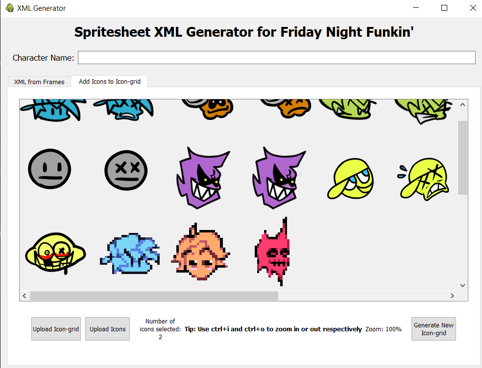

### Add your icon(s):
Friday Night Funkin' healthbar icons MUST be 150x150 pixels in size (according to it's source code). So make sure your icon(s) are all 150x150 pixels. If it's smaller, the application will just center the image into the next available 150x150 square so it can still work sometimes. However, the app will give you an error if your icon is any bigger than 150x150 pixels. Once you have added your icon(s), the number of icons that will be added will be shown at the bottom of the window as shown here:
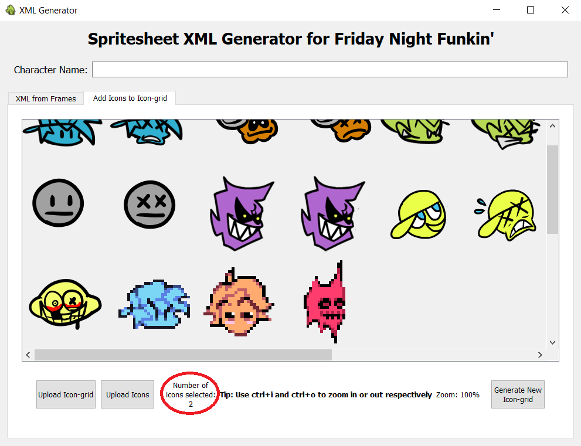

### Generate your new icongrid
Click the "Generate New Icon-grid" button and it will modify the iconGrid.png that was uploaded, adding your character icons to the grid, wherever it finds free space. In case the grid is full, it will show an error. But if it's successful, it will tell you the indices at which the icons were added (which is needed in order to add the icons into the game). Now you have successfully generated your new iconGrid.png file.<br />
<b>Update: There is now a checkbox called "Psych Engine mode", which when checked will allow you to make Psych-engine compatible icons. Just upload the 2 images and click "Generate New Icon-grid".</b>
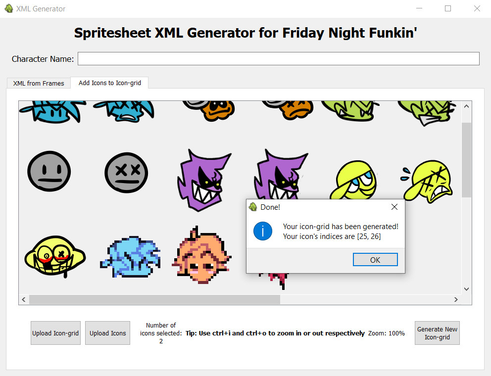
<div align="center">Dialog box when icons are added successfully</div>
<br /><br />
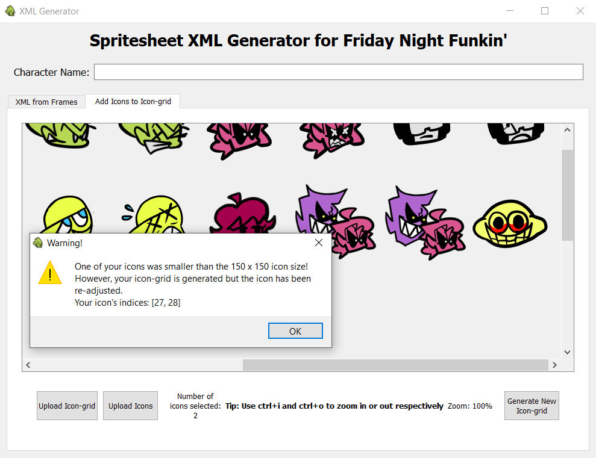
<div align="center">Dialog box when one of the icons are smaller than 150 x 150</div>
<br /><br />

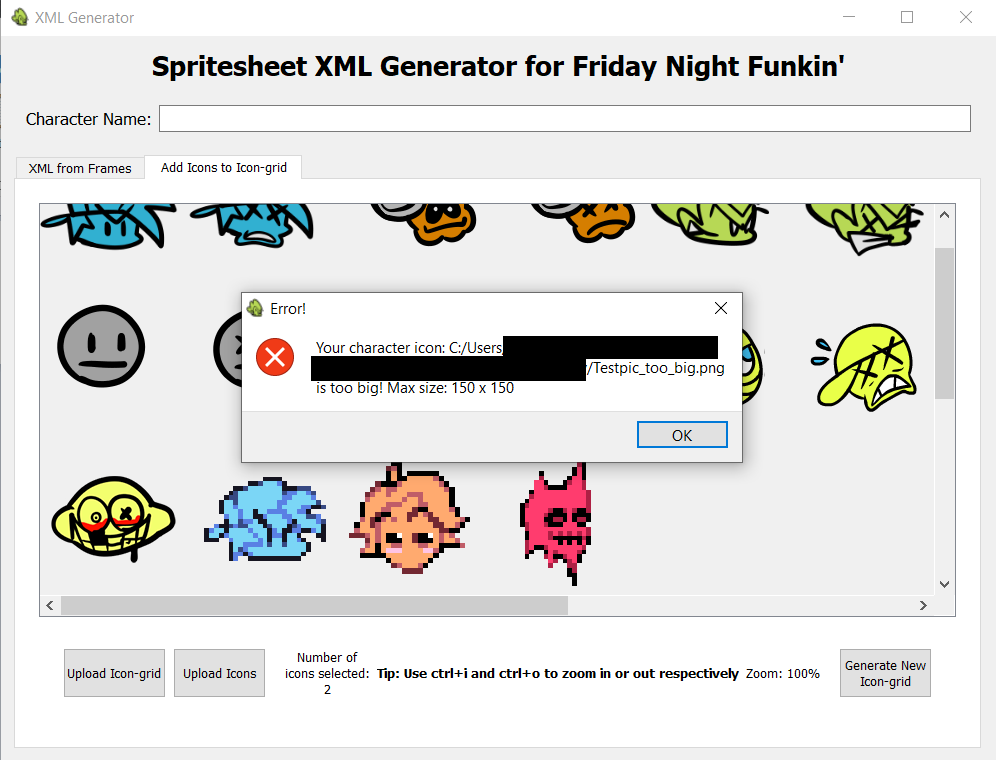
<div align="center">Dialog box when one of the icons is bigger than 150 x 150</div>
<br /><br />


## Running from source:
In order to run this from source, you will need <a href="https://www.python.org/downloads/">python</a> and pip installed on your device (pip should come pre-installed with python). Clone/download this repository by clicking the green button labelled "Code" and downloading the zip, then extract the contents of the zip file. Install the dependencies by opening the command line, navigating to this directory and typing ``` pip install -r requirements.txt ```. Once that is done type ``` cd src ``` <br /> ``` python xmlpngUI.py ``` to run the application (Sometimes you need to type ``` python3 ``` instead of just ``` python ```). This is a required step for non-windows users!

#### Side note: Feel free to make ports of this tool (for andriod, iOS, web etc.) if you can, just remember to open source it and credit this repository
